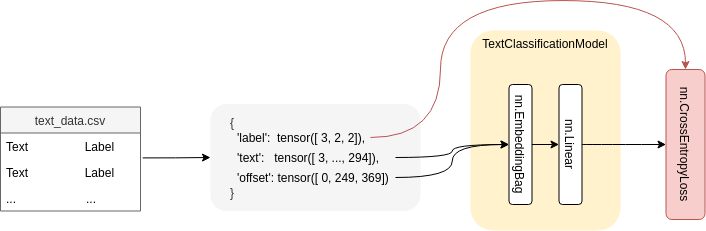

# Document classificator



---

- [Document classificator](#document-classificator)
  - [Install](#install)
  - [Data Preparation and Model Architecture](#data-preparation-and-model-architecture)
  - [Results](#results)

---

In this repository, I built a classifier that takes a document image and/or text and
predicts a certain class. 

The model is trained on a small toy dataset based on the [RVL-CDIP Dataset](http://www.cs.cmu.edu/~aharley/rvl-cdip/). The dataset contains 100 documents of 4 classes: 
- “resumee”,
- “invoice”, 
- “letter”, 
- “email.


## Install

The code comes with a ready-to-use conda enviroment:
```
git clone https://github.com/Davidelanz/document_classificator
cd document_classificator
conda env create -f environment.yml 
conda activate document_classificator
jupyter-lab
```

With the previous commands, you should be able to navigate easily the notebooks provided in the repository at http://localhost:8888/lab.

## Data Preparation and Model Architecture

The data preparation process (documented extensively in ``data_preparation.ipynb``) is adapted from Pytorch's [Text Sentiment n-Grams classification](https://pytorch.org/tutorials/beginner/text_sentiment_ngrams_tutorial.html) page. 

The model is quite simple. It is composed of a [nn.EmbeddingBag](https://pytorch.org/docs/stable/nn.html?highlight=embeddingbag#torch.nn.EmbeddingBag) layer plus a linear layer for the classification purpose. 

The model is trained using Cross-entropy Loss as a loss function, a SGD optimizer and a classic StepLR scheduler (details in ``text_classification.ipynb``).


## Results 

While in ``data_preparation.ipynb`` is exesively documented the data processing pipeline, the actual training results are made available in the ``text_classification.ipynb`` notebook. 

With a learning rate of 5 and a batch size of 8, the model reached its best fit at the end of epoch 10, with a train accuracy 100.0%, a validation accuracy of 90.0% and a test accuracy of 75.0%:


